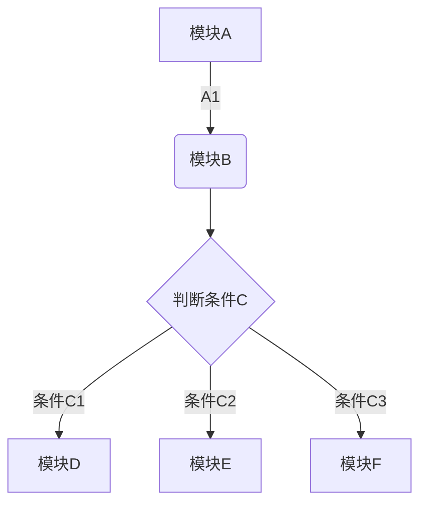
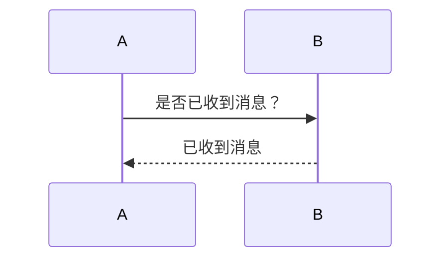
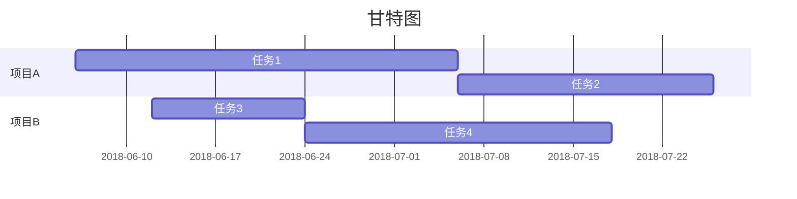

#MarkDown

##设置目录
设置之后可以自动根据设置的分级标题来自动生成目录。 
[TOC]
##二级标题
###三级标题
####四级标题
#####五级标题
######六级标题
* * *
##特殊文本

*斜体文本*
**粗体文本**
<u>下划线文本</u>
~~删除线~~
以下是分割线
>引用文本： Markdown 是一种轻量级的「标记语言」，创始人为约翰·格鲁伯，用简洁的语法代替排版，目前被越来越多的知识工作者、写作爱好者、程序员或研究员广泛使用。其常用的标记符号不超过十个，相对于更为复杂的 HTML 标记语言来说，Markdown 十分的轻量，学习成本也不需要太多，且一旦熟悉这种语法规则，会有沉浸式编辑的效果。
* * *
##符号与数字列表

**1. 第一部分
**2. 第二部分
     * 小模块
**3. 特点
     * 特点1
     * 特点2
     * 特点3
* * *
##添加待办事项

今日事项
*[x]事项1
*[]事项2
*[]事项3
* * *
##插入

###插入链接
[我的github](https://github.com/QianhuiYu-Fisher)

~~未完待续~~
~~我再来写个备注再切换分支~~
ok我回来了

###插入照片


###插入表格

| 帐户类型 | 免费帐户 | 标准帐户 | 高级帐户 |
| --- | --- | --- | --- |
| 帐户流量 | 60M | 1GB | 10GB |
| 设备数目 | 2台 | 无限制 | 无限制 |
| 当前价格 | 免费 | ￥8.17/月 | ￥12.33/月|

###插入图表

目前支持饼状图、折线图、柱状图和条形图，只需将 type 改为对应的pie、line、column 和 bar。

```chart
,预算,收入,花费,债务
June,5000,8000,4000,6000
July,3000,1000,4000,3000
Aug,5000,7000,6000,3000
Sep,7000,2000,3000,1000
Oct,6000,5000,4000,2000
Nov,4000,3000,5000,

type: pie
title: 每月收益
x.title: Amount
y.title: Month
y.suffix: $
```

###插入代码块

```python
#!/usr/bin/python
import re

line = "Cats are smarter than dogs"

matchObj = re.match( r'(.*) are (.*?) .*', line, re.M|re.I)

if matchObj:
    print "matchObj.group() : ", matchObj.group()
    print "matchObj.group(1) : ", matchObj.group(1)
    print "matchObj.group(2) : ", matchObj.group(2)
else:
    print "No match!!"
```

###插入数学公式

Markdown 支持绝大多数的 LaTeX 数学公式 

```math
e^{i\pi} + 1 = 0
```

###插入流程图



###插入时序图



###插入甘特图




